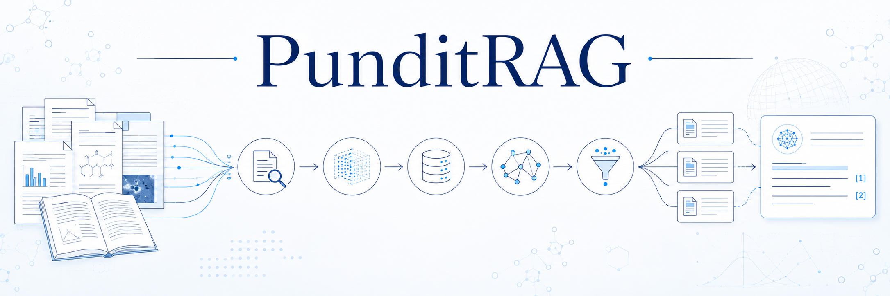
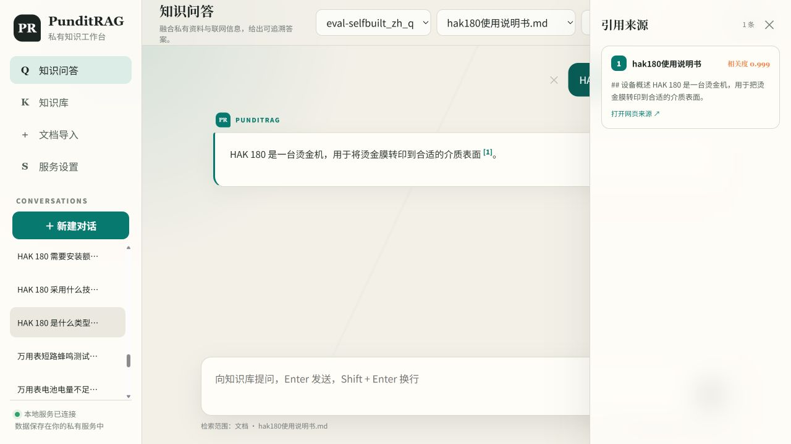
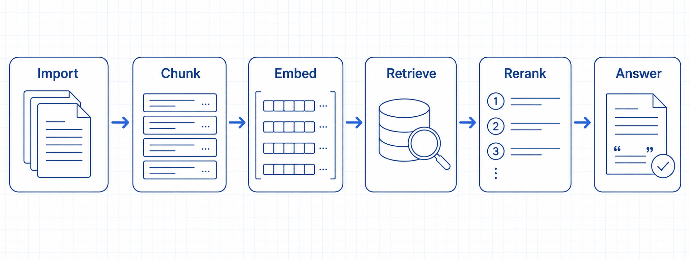
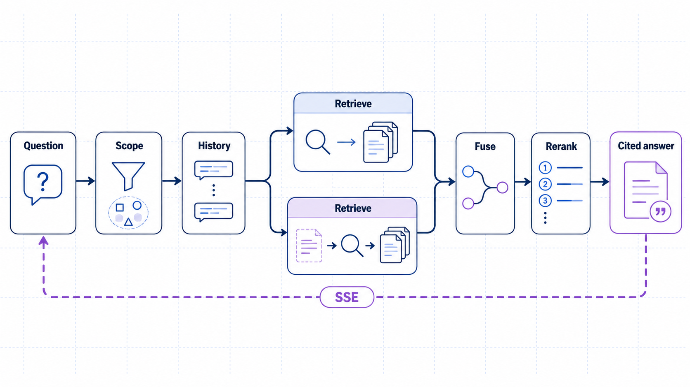

<div align="center">

<h1>PunditRAG</h1>
<p><strong>面向技术资料的可追溯 RAG 知识库</strong></p>
<p>导入文档，提出问题，沿着引用回到原文。</p>

[](https://www.python.org/)
[](https://github.com/langchain-ai/langgraph)
[](https://github.com/Pitkil/PunditRAG/actions/workflows/ci.yml)
[](LICENSE)

**简体中文** · [English](README.en.md)

[核心能力](#核心能力) · [界面预览](#界面预览) · [快速开始](#快速开始) · [检索原理](#检索原理) · [开发与评测](#开发与评测)

</div>

<p align="center"></p>

PunditRAG 将文档解析、混合检索和对话问答整合到一个知识库工作台中。你可以导入论文、技术手册、标准和产品资料，选择知识库或文档范围提问，查看回答引用的原文与本轮执行过程。

项目使用 LangGraph 编排导入和查询流程，提供 FastAPI 接口与 SSE 流式输出。Embedding 和 Reranker 在本地运行，对话模型通过 OpenAI-compatible API 配置。

## 核心能力

| 能力 | 使用价值 |
|---|---|
| **稠密 + 稀疏混合检索** | BGE-M3 同时检索语义相近内容与词项匹配内容，兼顾自然语言问题、型号、缩写和术语。 |
| **原问题 + HyDE 多路召回** | 用户问题与假设文档分别检索，经 RRF 合并候选，增加不同表述下找到原文的机会。 |
| **多语言重排** | BGE Reranker 联合阅读问题与候选内容，按相关性排序并控制证据数量。 |
| **完整文档与邻居上下文** | 符合预算的所选文档直接读取全部切片；长文档检索后补充同章节相邻片段。 |
| **回答与原文关联** | 文档依据使用 `[n]` 引用，来源面板展示正文；没有资料依据时允许明确标识的 AI 通识回答。 |
| **可操作的知识库工作台** | 管理文档与会话，查看执行轨迹，删除单条消息、清空聊天记录，按需开启联网补充。 |

支持 PDF、Markdown、TXT、DOCX、PPTX、XLSX、CSV、HTML、JSON 等文件。PDF 使用 MinerU API 解析，其他支持格式在本地转换为 Markdown，再进行结构化切分。

## 界面预览

**知识库问答工作台** — 选择资料范围、提问，并查看引用来源。

<p align="center"></p>

<details>
<summary>查看执行轨迹截图</summary>

<p align="center"></p>

</details>

## 快速开始

### 1. 准备环境

安装 Docker Desktop / Docker Engine 与 Docker Compose，并准备一个 OpenAI-compatible 模型服务的 API Key。导入 PDF 时还需要 MinerU API Token。

默认 Compose 使用 NVIDIA GPU；Linux 主机需要 NVIDIA Container Toolkit，Windows 使用支持 GPU 的 Docker Desktop 环境。CPU 运行时，将 `BGE_DEVICE` 和 `BGE_RERANKER_DEVICE` 设为 `cpu`，将两个 FP16 配置设为 `0`，并移除 Compose 中的 `gpus: all`。

### 2. 下载与配置

```bash
git clone https://github.com/Pitkil/PunditRAG.git
cd PunditRAG
```

Windows PowerShell：

```powershell
Copy-Item .env.docker.example .env.docker
notepad .env.docker
```

Linux / macOS 使用 `cp .env.docker.example .env.docker`，再通过文本编辑器填写配置：

| 配置 | 填写内容 |
|---|---|
| `OPENAI_API_KEY` | 模型服务的 API Key |
| `OPENAI_BASE_URL` | 服务商提供的兼容接口基础地址 |
| `LLM_DEFAULT_MODEL` | 对话模型名称 |
| `VL_MODEL` | 同一服务商下支持图片输入的模型，供图片摘要使用 |
| `MINERU_API_TOKEN` | PDF 解析凭据 |
| `MONGO_ROOT_PASSWORD` / `MINIO_ROOT_PASSWORD` | 替换模板中的服务密码；Compose 自动派生应用连接配置 |

默认模板使用 DashScope。OrcaRouter 的文本模型配置示例：

```dotenv
OPENAI_API_KEY=replace-with-your-orcarouter-key
OPENAI_BASE_URL=https://api.orcarouter.ai/v1
LLM_DEFAULT_MODEL=openai/gpt-4o-mini
```

模型名以服务商目录为准；切换服务商时也要核对 `VL_MODEL`。普通调用、JSON 输出和图片输入能力取决于所选接口与模型，配置示例不代表所有服务商均已实测。可选扩展参数通过 `OPENAI_EXTRA_BODY_JSON` 设置为 JSON 对象。

### 3. 启动

Windows：

```powershell
.\start.ps1
```

脚本在没有应用镜像时自动构建，后续启动复用镜像；需要重建时运行 `.\start.ps1 -Build`。首次使用需要下载本地 Embedding 和 Reranker 模型。

其他平台也可以直接使用 Compose：

```bash
docker compose --env-file .env.docker up -d --build
```

后续启动可去掉 `--build`。

### 4. 导入资料并提问

打开 [知识库工作台](http://127.0.0.1:8001/query/html)，创建知识库，上传文档并等待导入完成。选择知识库或具体文档后提问，例如“详细讲解这篇论文的方法与实验结果”。

可以先上传仓库自带的 [示例说明书](eval/datasets/documents/万用表RS-12的使用.md)，再问“这款万用表使用什么电池？”。点击回答中的来源，核对对应原文。

<details>
<summary>服务地址与常用运维命令</summary>

| 服务 | 地址 |
|---|---|
| 工作台 | http://127.0.0.1:8001/query/html |
| 导入 API 文档 | http://127.0.0.1:8000/docs |
| 查询 API 文档 | http://127.0.0.1:8001/docs |
| MinIO Console | http://127.0.0.1:9101 |

```bash
docker compose --env-file .env.docker ps
docker compose --env-file .env.docker logs -f app
docker compose --env-file .env.docker down
```

</details>

## 检索原理

### 稠密检索与稀疏检索：两种互补信号

**稠密检索（Dense）** 将问题与文档编码为连续向量，寻找语义相关的片段。例如“电池多久换一次”与原文“续航时间”用词不同，仍可能通过语义相似度召回。

**稀疏检索（Sparse）** 使用 BGE-M3 生成的词项权重向量，补充术语、缩写和型号等词项匹配信号。它是模型生成的稀疏表示，当前实现并不是单独接入 BM25；具体编号是否完全一致仍需核对原文。

两路都在 Milvus 中使用内积检索。片段混合检索通过 `WeightedRanker` 融合稠密与稀疏得分，默认权重为 `0.5 / 0.5`。

### 原问题与 HyDE：扩展检索表达

常规检索路径并行执行两个分支，每个分支都使用 Dense + Sparse：

| 分支 | 检索输入 | 作用 |
|---|---|---|
| 原问题分支 | 用户原话，结合当前文档名或已匹配主题补充检索上下文 | 保留实际问题与显式范围。 |
| HyDE 分支 | 模型生成的假设文档 | 用接近正文的表述补充召回。生成文本仅用于搜索，不作为答案证据。 |

主题名称 `item_name` 还会触发范围内的补充搜索，并与范围内的常规结果去重合并。主题匹配不会替代知识库或文档范围过滤。

HyDE 默认设置 10 秒调用超时，失败后返回空候选，原问题检索可以继续。

### RRF：融合两个分支的排名

分支内的 Dense/Sparse 加权融合之后，`node_rrf` 再合并原问题与 HyDE 的候选列表：

```text
RRF(d) = Σ 1 / (60 + rank_i(d))
```

两条分支权重均为 1；同一片段在多条列表中出现时累积分数。RRF 使用排名，不直接相加两条分支的原始相似度分数。默认保留前 30 个候选进入后续处理。

开启联网时，网页候选在重排节点与本地 RRF 结果合并；网页不参与上述本地 RRF 分数计算。

### Reranker：从候选中选择证据

BGE Reranker 联合输入用户原问题、文档标题、章节和候选正文，重新计算相关性。系统随后去重、按阈值分级，并根据相邻候选的分差控制保留数量。

当候选均低于阈值时，系统保留有限数量的非零低分片段，标记为低置信，供回答模型阅读核验。重排得分用于选择上下文，不代表内容真实性或答案正确率。

对于指定文档的检索结果，系统在最终锚点附近补充同文档、同章节的前后片段，默认 `part ± 1`。这些邻居用于恢复连续上下文，扩展发生在重排之后。

## 系统架构与对话流程

<p align="center"></p>

导入阶段将文档转换为 Markdown，按标题、段落和表格结构切分，并添加文档主题与元数据。BGE-M3 编码后写入 Milvus；MongoDB 保存文档与会话信息，MinIO 保存 Markdown 图片处理路径中的图片。

<p align="center"></p>

上图展示常规检索分支。完整处理过程还包含短文档直读、全文总结及可选联网：

| 步骤与数据传递 | 具体行为 |
|---|---|
| 用户 → API | 提交问题、资料范围与会话标识；API 校验范围并生成本轮 `run_id`。 |
| API → 主题规划 | 读取本会话历史，提取辅助召回主题并判断是否需要全文综合，保留用户原问题。 |
| 规划 → 文档上下文 | 显式所选文档已完成导入、切片完整且总正文不超过预算时，直接交给回答节点；该路径要求关闭联网且未进入全文总结。 |
| 常规检索 → RRF | 原问题和 HyDE 分别执行混合召回，再按排名融合本地候选。 |
| RRF / 可选网页 → 重排 | 合并候选、重排与去重；指定文档时补充同章节邻居。 |
| 全文总结 → 回答 | 全文任务使用短文档综合或长文档 Map/Reduce，保留来源关联。 |
| 上下文 → 回答模型 | 同时提供当前问题、最近历史和正文。资料事实带引用；无依据时允许带“AI 通识回答”标识的无引用回答。 |
| 回答 → 用户 / MongoDB | 校验引用与图片、整理来源并保存消息；流式生成发送 `delta`，最终用 `final` 返回完整结果。 |

`session_id` 关联多轮历史，`run_id` 隔离单次执行与 SSE 事件。流式答案从生成节点开始输出，之前的检索过程可在工作台查看进度。

<details>
<summary>检索与上下文参数</summary>

默认值来自 [retrieval_config.py](app/conf/retrieval_config.py)，可在环境变量中调整。

| 参数 | 默认值 | 含义 |
|---|---:|---|
| `CHUNK_SIZE_TOKENS` / `CHUNK_OVERLAP_TOKENS` | 500 / 80 | 近似 token 切分预算与重叠 |
| `RETRIEVAL_TOP_K` | 20 | 每次常规混合召回上限 |
| `TOPIC_EXPANSION_TOP_K` | 10 | 主题补充召回上限 |
| `RRF_TOP_K` / `RERANK_INPUT_TOP_K` | 30 / 30 | 融合输出与本地重排候选上限 |
| `RERANK_MAX_TOP_K` | 8 | 邻居扩展前的证据数量上限 |
| `RERANK_MIN_TOP_K` | 2 | 断崖截断的最低保留目标，不会补造候选 |
| `RERANK_MIN_SCORE` | 0.09 | 相关性分级阈值 |
| `RERANK_FALLBACK_TOP_K` | 8 | 低分候选兜底上限 |
| `DIRECT_DOCUMENT_MAX_CHARS` | 64000 | 所选文档全部切片正文的字符预算，并非模型 token 上限 |
| `NEIGHBOR_EXPAND_PARTS` | 1 | 重排锚点前后同章节邻居数量 |

</details>

## API 与代码导航

导入服务运行在 `:8000`，查询服务运行在 `:8001`。完整请求结构见启动后的 FastAPI `/docs`。

| 接口 | 用途 |
|---|---|
| `POST :8000/knowledge-bases` | 创建知识库 |
| `POST :8000/upload` | 上传文件，返回导入任务标识 |
| `GET :8000/status/{task_id}` | 查看导入进度 |
| `POST :8001/query` | 发起问答，支持非流式和流式模式 |
| `GET :8001/query/stream/{run_id}` | 订阅 SSE |
| `GET :8001/history/{session_id}` | 读取会话历史 |
| `DELETE :8001/history/{session_id}/messages/{message_id}` | 删除单条消息 |
| `DELETE :8001/history/{session_id}` | 清空会话历史 |

学习实现时可以按以下顺序阅读：

1. [导入图](app/import_process/agent/main_graph.py)：格式分流、解析、切分、主题识别与向量入库。
2. [查询图](app/query_process/agent/main_graph.py)：全文上下文、并行检索与生成编排。
3. [检索工具](app/query_process/agent/retrieval_utils.py)、[RRF](app/query_process/agent/nodes/node_rrf.py) 与 [重排节点](app/query_process/agent/nodes/node_rerank.py)：范围过滤、候选融合与邻居扩展。
4. [回答节点](app/query_process/agent/nodes/node_answer_output.py) 与 [Prompt](prompts/)：原问题、历史、正文与引用如何交给模型。
5. [查询 API](app/query_process/api/server.py)：工作台、会话管理和 SSE。

## 开发与评测

本机开发使用 Python 3.11+ 和 `uv`，环境变量模板见 [.env.example](.env.example)。

```bash
uv sync --frozen
uv run --no-sync python test/16_node_rerank.py
uv run --no-sync python test/18_node_answer_output.py
uv run --no-sync python test/19_workspace_features.py
uv run --no-sync python test/20_rag_reliability.py
uv run --no-sync python test/21_reliability_hardening.py
```

[GitHub Actions](.github/workflows/ci.yml) 配置了离线回归、Python 编译检查与 Dockerfile 检查；主分支推送和手动运行还包含镜像构建。最新执行结果见 [Actions](https://github.com/Pitkil/PunditRAG/actions)。

评测包含 [自建固定集](eval/run_eval.py) 和 RGB、CRUD-RAG、MTRAG 适配器。准备好本地服务与模型凭据后运行：

```bash
uv run --no-sync python eval/run_eval.py
```

数据来源、运行方法及历史抽样成绩见 [评测文档](eval/README.md)。其中公开数据集成绩记录于 2026-08-17，属于当时版本的抽样结果；本次 README 调整没有重新运行评测。

## 部署说明

文档嵌入与重排在本地执行；问题、候选正文以及相关历史会发送给配置的 LLM 服务。PDF 发送给 MinerU 解析，图片摘要使用配置的视觉模型。联网补充默认关闭，目前使用独立配置的 DashScope Web Search MCP，不随 LLM Base URL 自动切换。

当前工作台适合本地或可信网络部署。对外提供服务时应先配置身份认证与访问控制，详见 [安全说明](SECURITY.md)。

## 贡献与许可

欢迎通过 [Issues](https://github.com/Pitkil/PunditRAG/issues) 分享使用反馈，也欢迎提交文档、测试与功能改进。开发约定见 [贡献指南](CONTRIBUTING.md)，版本变化见 [更新日志](CHANGELOG.md)。

项目采用 [MIT License](LICENSE)。第三方模型、服务和数据集遵循各自许可；示例资料与公开数据来源见 [第三方数据说明](eval/THIRD_PARTY_DATA.md)。
